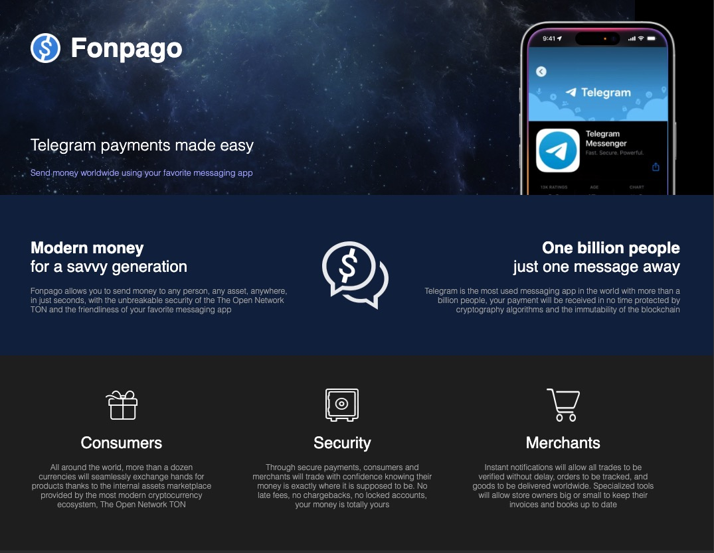

# FONPAGO

## Payments in Telegram

Fonpago is a Telegram Bot used to send payments around the world

Fonpago allows you to send money to any person, any asset, anywhere, in just seconds, with the unbreakable security of the The Open Network TON and the friendliness of your favorite messaging app

Telegram is the most used messaging app in the world with more than a billion people, your payment will be received in no time protected by cryptography algorithms and the immutability of the blockchain



Here is a list of things you can do with FonpagoBot:

```
  *register*: create account and register user name

    register George
    register JohnDoe
    register Patty123
    register Walmart

  Note: only letters and numbers, no special characters or spaces

  *account*: show your public key and qr-code

  *name*: change the name of your account

  *balance*: show the balance in your account

  *history*: show last 10 transactions

  *pay*: send money to Fonpago users

    pay 100 to George
    pay 150 BRL to Caroline
    pay 200 USD to Walmart ref 123456

  Note: refs are useful for tracking payments to merchant orders

  *price* to check TON price

  *price BTC* to check any crypto/forex price by symbol

  *help*: this information
```

